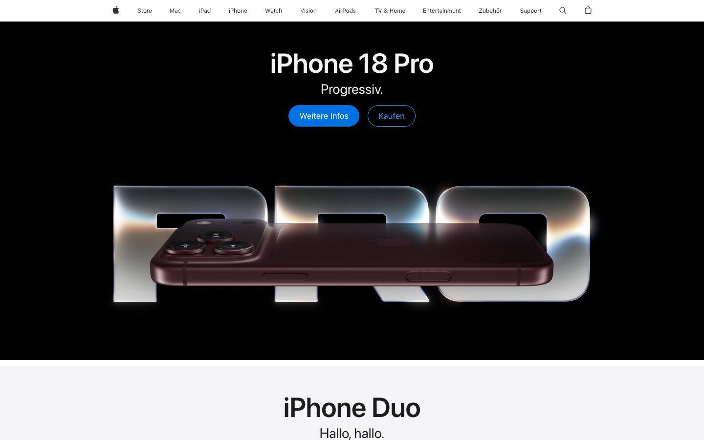
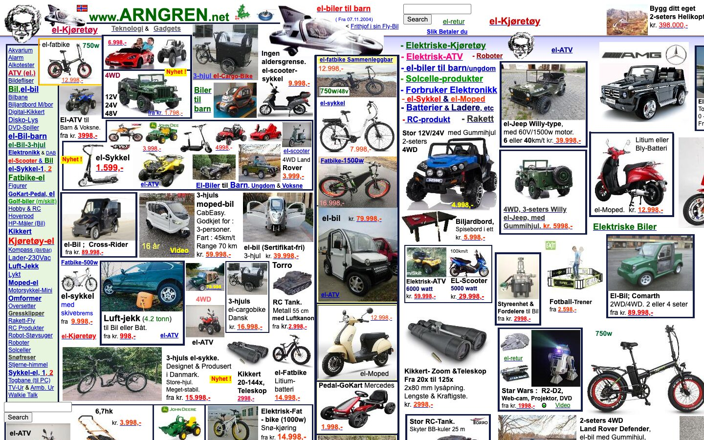
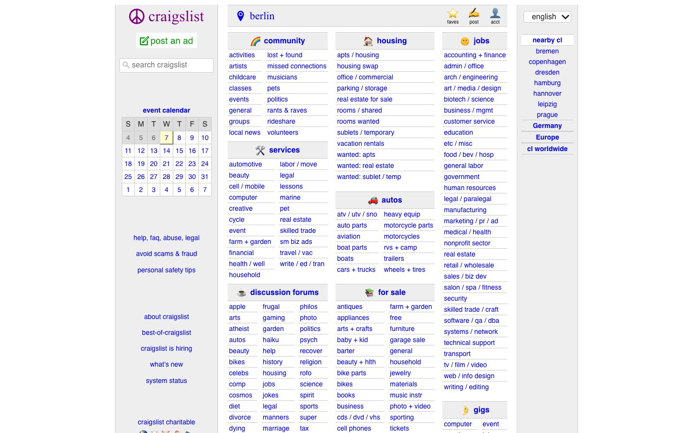
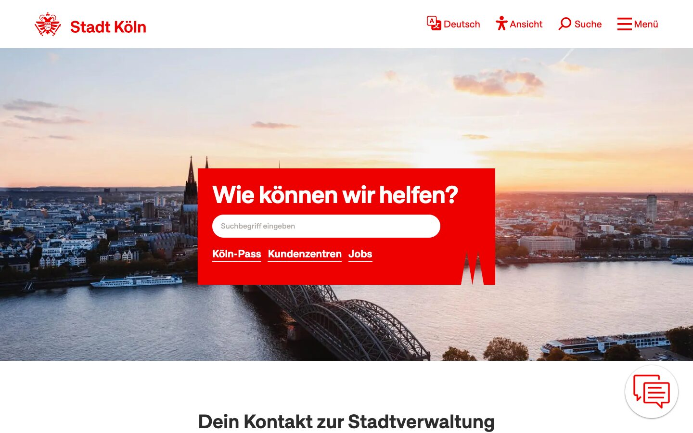



<section class="simple" data-transition="none">
  

    <h1>Seite 1</h1>
    
Daumen hoch oder runter?

    

  

</section>

<section class="simple" data-transition="none">
  

    <h1>Seite 2</h1>
    
Daumen hoch oder runter?

    

  

</section>

<section class="simple" data-transition="none">
  

    <h1>Seite 3</h1>
    
Daumen hoch oder runter?

    

  

</section>

<section class="simple" data-transition="none">
  

    <h1>Seite 4</h1>
    
Daumen hoch oder runter?

    

  

</section>











