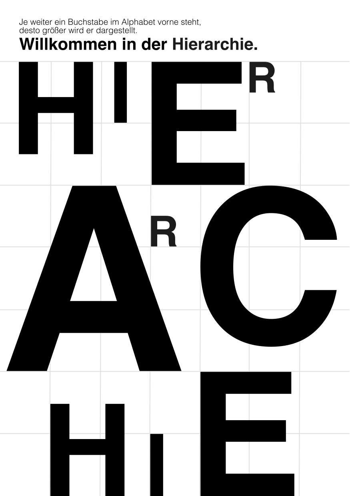
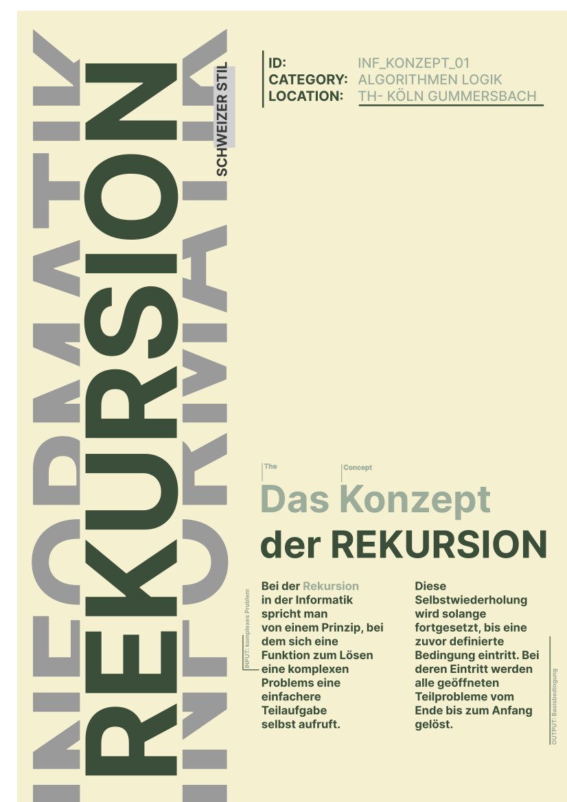
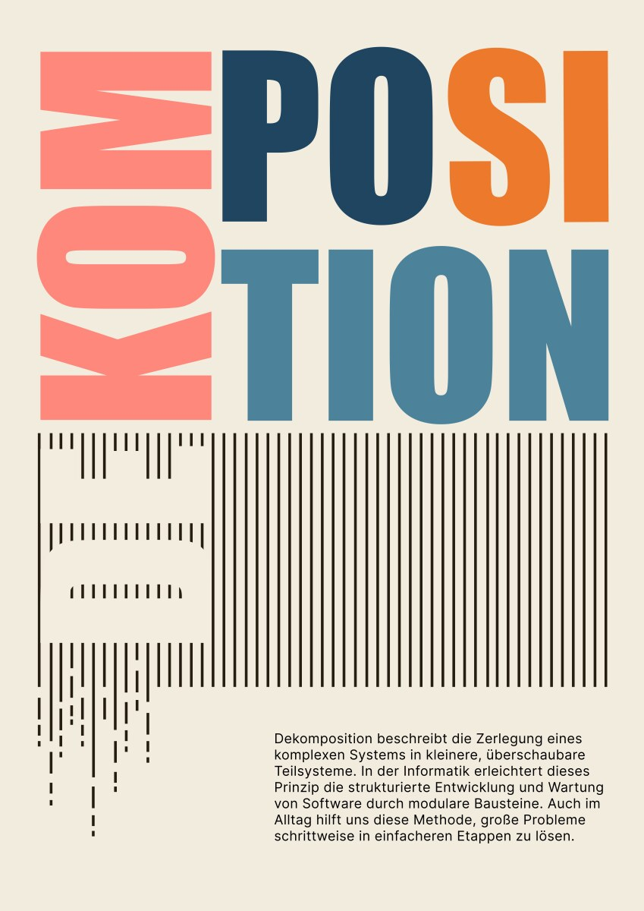
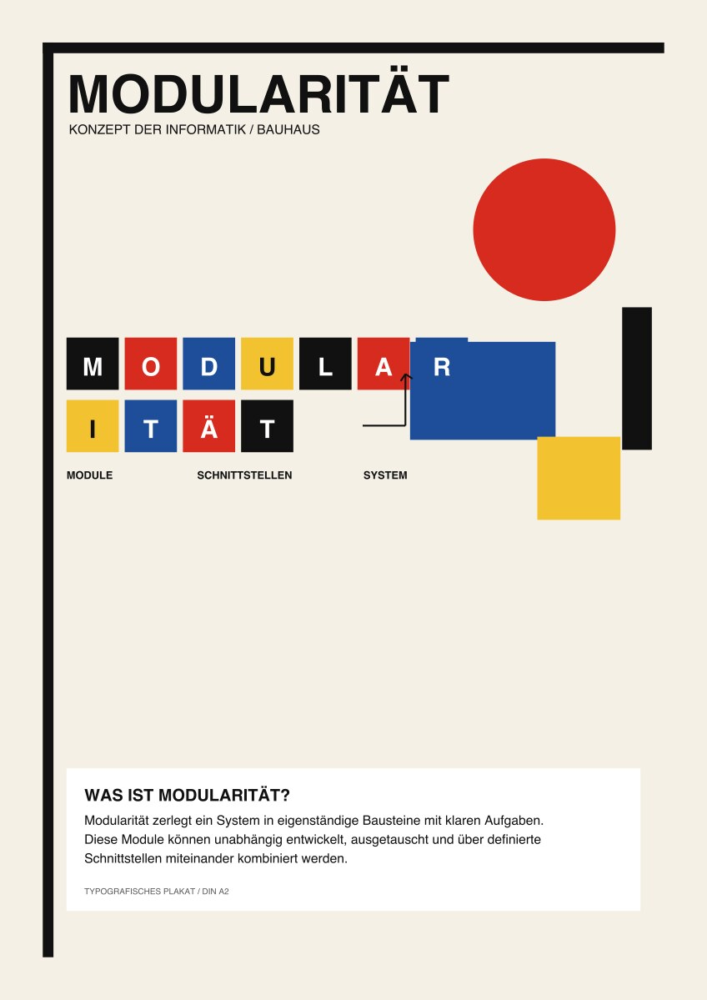
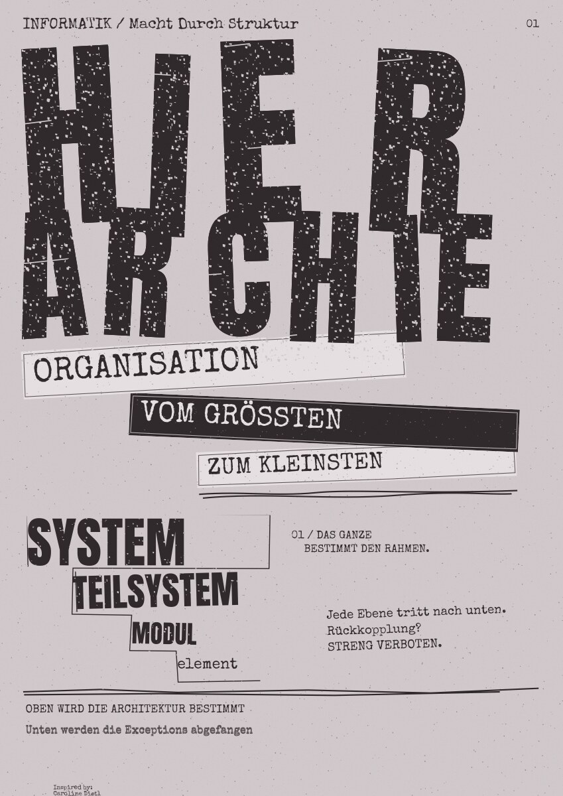









<section class="simple" data-transition="fade">
  

    

      <figure style="margin:0; text-align:center; flex:1 1 0; min-width:0;"><figcaption>
<strong>1</strong>
</figcaption></figure>
      <figure style="margin:0; text-align:center; flex:1 1 0; min-width:0;"><figcaption>
<strong>2</strong>
</figcaption></figure>
      <figure style="margin:0; text-align:center; flex:1 1 0; min-width:0;"><figcaption>
<strong>3</strong>
</figcaption></figure>
      <figure style="margin:0; text-align:center; flex:1 1 0; min-width:0;"><figcaption>
<strong>4</strong>
</figcaption></figure>
      <figure style="margin:0; text-align:center; flex:1 1 0; min-width:0;"><figcaption>
<strong>5</strong>
</figcaption></figure>
    

  

</section>





