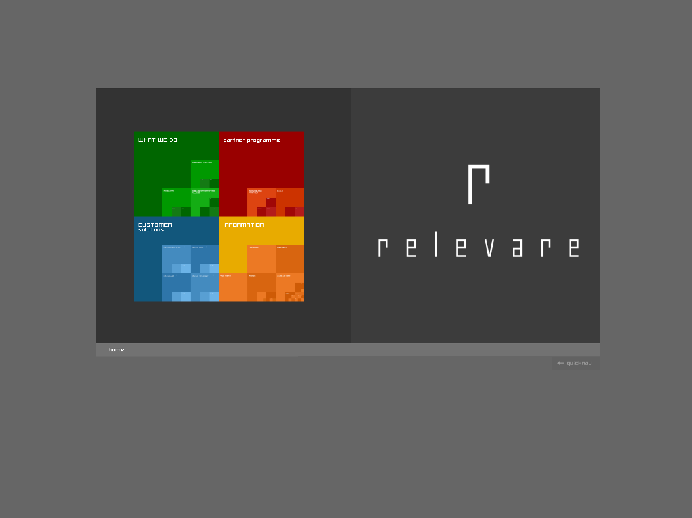
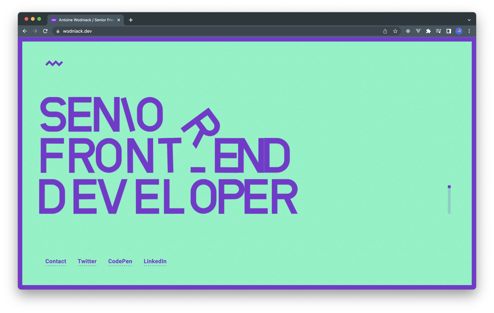
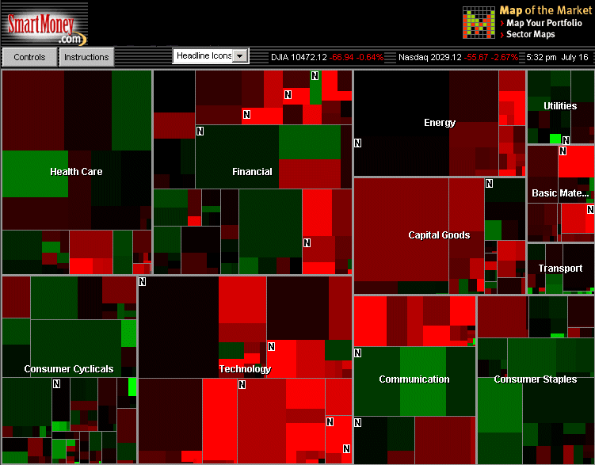
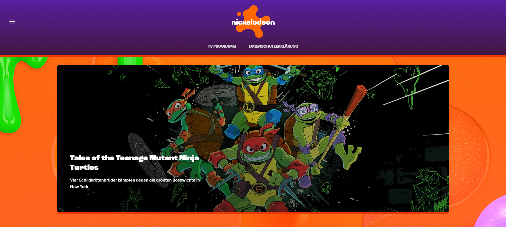
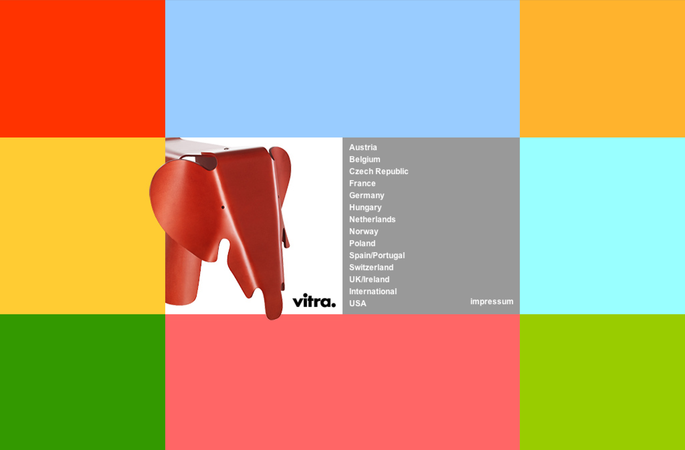
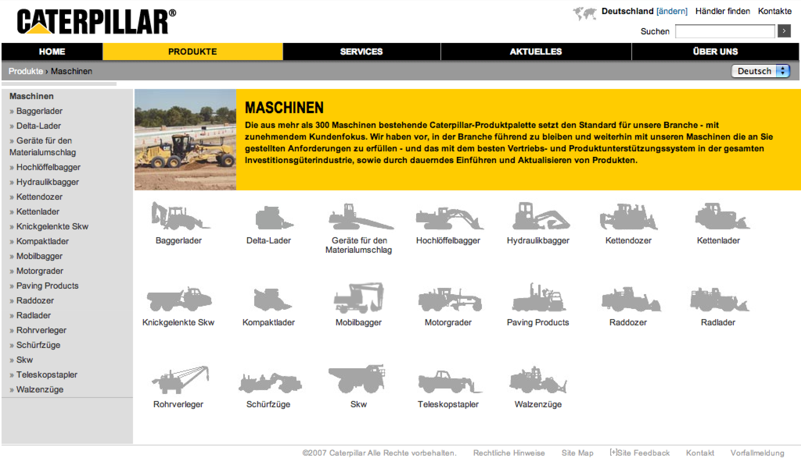
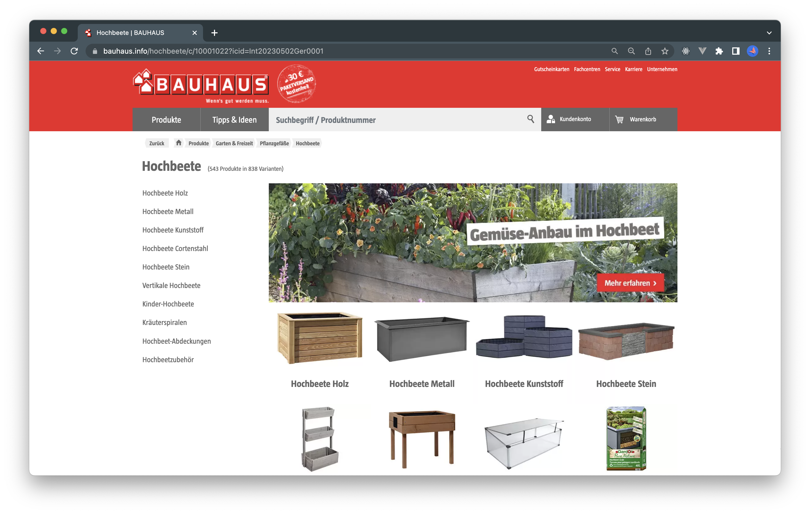
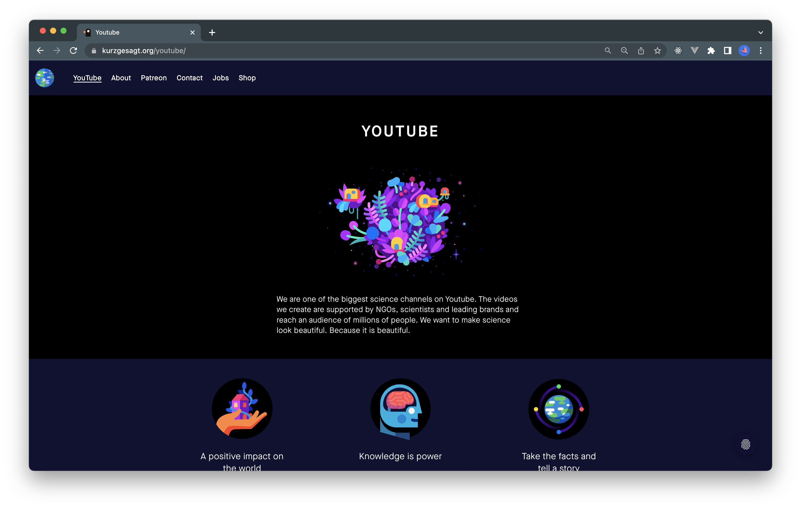
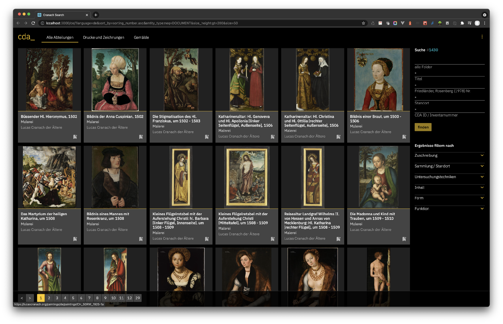











<!--section class="image screenshot">
  <figure>
    
    <figcaption class="bu">
      
Komplementärkontrast

      

        <a href="https://thefwa.com/cases/relevare" target="_blank">Relevare</a>
      
 
    </figcaption>
  </figure>
</section-->

<section class="image screenshot no-shadow">
  <figure>
    
    <figcaption class="bu">
      
Komplementärkontrast

      

        <a href="https://wodniack.dev/" target="_blank">Wodniack</a>
      
 
    </figcaption>
  </figure>
</section>

<section class="image screenshot no-shadow">
  <figure>
    
    <figcaption class="bu">
      
Komplementärkontrast

      

        <a href="https://bambini.cmsmasters.net/" target="_blank">Bambini</a>
      
 
    </figcaption>
  </figure>
</section>

<!--section class="image screenshot">
  <figure>
    
    <figcaption class="bu">
      
Komplementärkontrast

      

        <a href="https://www.bewitched.com/marketmap.html" target="_blank">Map of the Market</a>
      
 
    </figcaption>
  </figure>
</section-->





<section class="image screenshot">
  <figure>
    
    <figcaption class="bu">
      
Farbe-an-sich Kontrast

      

        <a href="https://www.thalia.de/" target="_blank">Mayersche</a>
      
 
    </figcaption>
  </figure>
</section>

<section class="image screenshot no-shadow">
  <figure>
    
    <figcaption class="bu">
      
Farbe-an-sich Kontrast

      

        <a href="https://www.nintendo.de/" target="_blank">Nintendo</a>
      
 
    </figcaption>
  </figure>
</section>

<section class="image screenshot">
  <figure>
    
    <figcaption class="bu">
      
Farbe-an-sich Kontrast

      

        <a href="https://www.nick.de" target="_blank">Nickelodeon</a>
      
 
    </figcaption>
  </figure>
</section>



<section class="image screenshot">
  <figure>
    
    <figcaption class="bu">
      
Farbe-an-sich Kontrast

      

        <a href="https://web.archive.org/web/20060106074604/http://www.vitra.de//" target="_blank">web.archive.org</a>
      
 
    </figcaption>
  </figure>
</section>





<section class="image screenshot">
  <figure>
    
    <figcaption class="bu">
      
Quantitätskontrast

      

        <a href="https://nachdemfilm.de/" target="_blank">Nach dem Film</a>
      
 
    </figcaption>
  </figure>
</section>

<section class="image screenshot">
  <figure>
    
    <figcaption class="bu">
      
Quantitätskontrast

      

        <a href="https://www.cat.com/de_DE.html" target="_blank">Caterpillar</a>
      
 
    </figcaption>
  </figure>
</section>





<section class="image screenshot no-shadow">
  <figure>
    
    <figcaption class="bu">
      
Farbe-an-sich Kontrast

      

        <a href="https://www.th-koeln.de/" target="_blank">Th Köln</a>
      
 
    </figcaption>
  </figure>
</section>

<section class="image screenshot no-shadow">
  <figure>
    
    <figcaption class="bu">
      
Farbe-an-sich Kontrast

      

        <a href="https://www.bauhaus.info/" target="_blank">Bauhaus</a>
      
 
    </figcaption>
  </figure>
</section>

<section class="image screenshot no-shadow">
  <figure>
    
    <figcaption class="bu">
      
Farbe-an-sich Kontrast

      

        <a href="https://v2.vuejs.org/" target="_blank">Vue.Js</a>
      
 
    </figcaption>
  </figure>
</section>

<section class="image screenshot no-shadow">
  <figure>
    
    <figcaption class="bu">
      
Farbe-an-sich Kontrast

      

        <a href="https://sushi-bikes.com/" target="_blank">Sushi Bikes</a>
      
 
    </figcaption>
  </figure>
</section>

<!--  -->







<section class="image screenshot no-shadow">
  <figure>
    
    <figcaption class="bu">
      
Hell-Dunkel Kontrast

      

        <a href="https://kurzgesagt.org/" target="_blank">Kurzgesagt</a>
      
 
    </figcaption>
  </figure>
</section>

<section class="image screenshot no-shadow">
  <figure>
    
    <figcaption class="bu">
      
Hell-Dunkel Kontrast

      

        <a href="https://lucascranach.org/de/search/" target="_blank">cda</a>
      
 
    </figcaption>
  </figure>
</section>

<section class="image screenshot no-shadow">
  <figure>
    
    <figcaption class="bu">
      
Hell-Dunkel Kontrast

      

        <a href="https://www.jetbrains.com/de-de/" target="_blank">Jetbrains</a>
      
 
    </figcaption>
  </figure>
</section>

<section class="image screenshot no-shadow">
  <figure>
    
    <figcaption class="bu">
      
Hell-Dunkel Kontrast

      

        <a href="https://www.bega.com/de-de/" target="_blank">Bega</a>
      
 
    </figcaption>
  </figure>
</section>











































