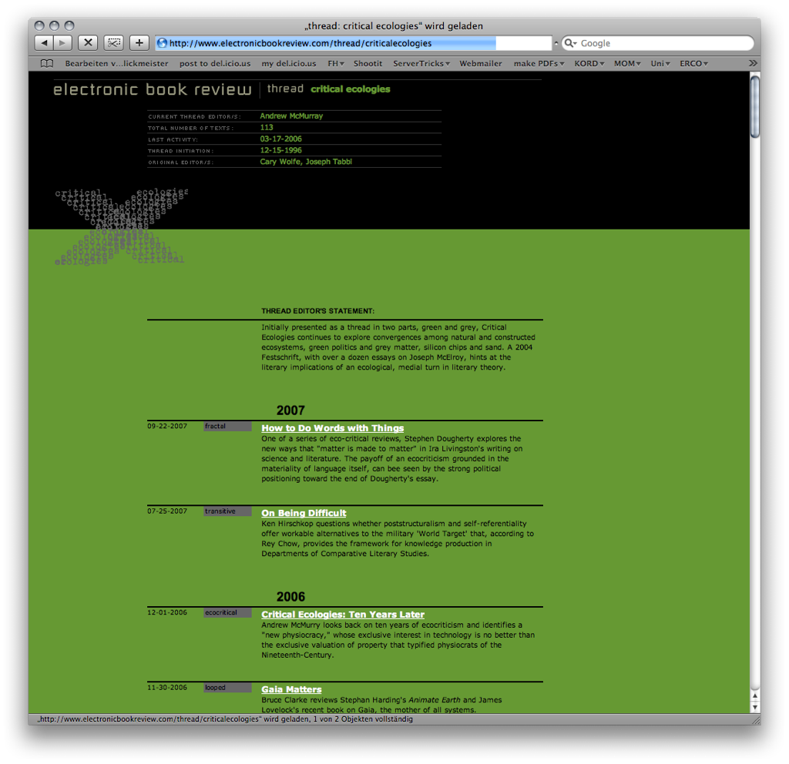



<section class="image screenshot shadow">
  <figure>
    
    <figcaption class="bu">
      
Das Netz der Stadt

      

        <a href="https://www.b-schmitz.com/das-netz-der-stadt" target="_blank">Benedikt Schmitz</a>
      
 
    </figcaption>
  </figure>
</section>



<section class="image screenshot no-shadow">
  <figure>
    
    <figcaption class="bu">
      
Farbe zum Orientieren

      

        <a href="https://green-planet-energy.de/" target="_blank">Green Planet Energy</a>
      
 
    </figcaption>
  </figure>
</section>

<section class="image screenshot no-shadow">
  <figure>
    
    <figcaption class="bu">
      
Farbe zum Orientieren

      

        <a href="https://green-planet-energy.de/" target="_blank">Green Planet Energy</a>
      
 
    </figcaption>
  </figure>
</section>

<section class="image screenshot no-shadow">
  <figure>
    
    <figcaption class="bu">
      
Farbe zum Orientieren

      

        <a href="https://green-planet-energy.de/" target="_blank">Green Planet Energy</a>
      
 
    </figcaption>
  </figure>
</section>

<section class="image screenshot no-shadow">
  <figure>
    
    <figcaption class="bu">
      
Farbe zum Orientieren

      

        <a href="https://electronicbookreview.com/" target="_blank">Electronic Book Review</a>
      
 
    </figcaption>
  </figure>
</section>

<section class="image screenshot no-shadow">
  <figure>
    
    <figcaption class="bu">
      
Farbe zum Orientieren

      

        <a href="https://electronicbookreview.com/" target="_blank">Electronic Book Review</a>
      
 
    </figcaption>
  </figure>
</section>

<section class="image screenshot no-shadow">
  <figure>
    
    <figcaption class="bu">
      
Farbe zum Orientieren

      

        <a href="https://electronicbookreview.com/" target="_blank">Electronic Book Review</a>
      
 
    </figcaption>
  </figure>
</section>

<section class="image screenshot no-shadow">
  <figure>
    
    <figcaption class="bu">
      
Farbe zum Orientieren

      

        <a href="https://electronicbookreview.com/" target="_blank">Electronic Book Review</a>
      
 
    </figcaption>
  </figure>
</section>













