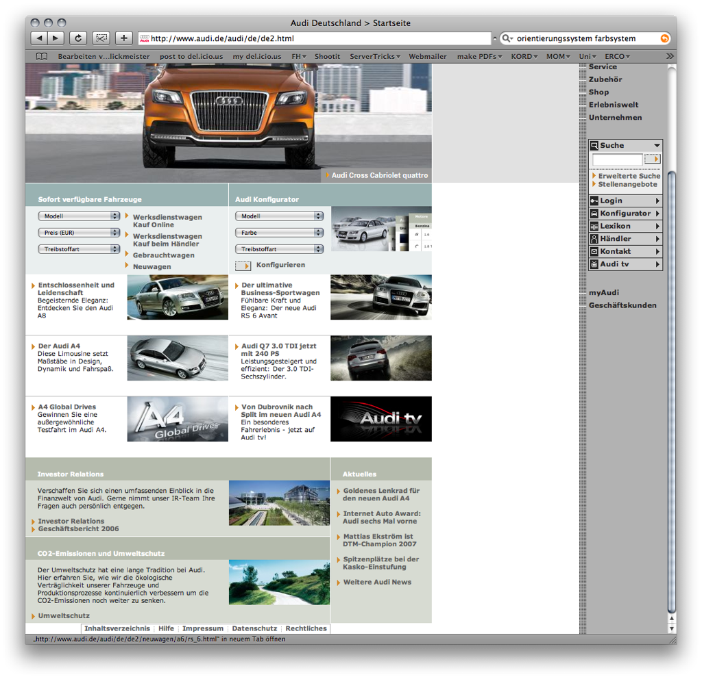
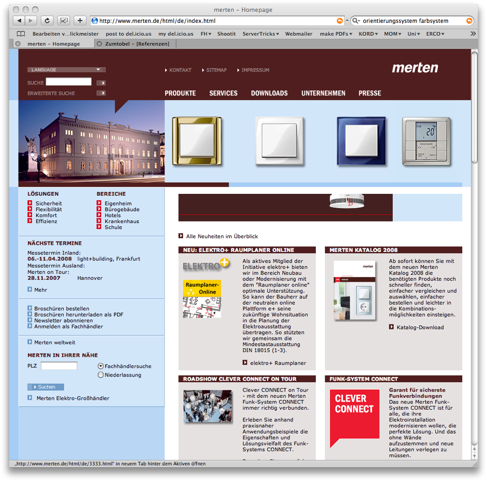





<section class="image screenshot no-shadow">
  <figure>
    
    <figcaption class="bu">
      
Farbe zum Strukturieren

      

        <a href="https://www.mskgent.be/" target="_blank">Museums für Schöne Künste</a>
      
 
    </figcaption>
  </figure>
</section>

<section class="image screenshot no-shadow">
  <figure>
    
    <figcaption class="bu">
      
Farbe zum Strukturieren

      

        <a href="https://www.mskgent.be/" target="_blank">Museums für Schöne Künste</a>
      
 
    </figcaption>
  </figure>
</section>

<section class="image screenshot no-shadow">
  <figure>
    
    <figcaption class="bu">
      
Farbe zum Strukturieren

      

        <a href="https://www.mskgent.be/" target="_blank">Museums für Schöne Künste</a>
      
 
    </figcaption>
  </figure>
</section>

<section class="image screenshot no-shadow">
  <figure>
    
    <figcaption class="bu">
      
Farbe zum Strukturieren

      

        <a href="https://www.mskgent.be/" target="_blank">Audi</a>
      
 
    </figcaption>
  </figure>
</section>

<section class="image screenshot no-shadow">
  <figure>
    
    <figcaption class="bu">
      
Farbe zum Strukturieren

      

        <a href="https://www.audi.de/de/brand/de.html" target="_blank">Merten</a>
      
 
    </figcaption>
  </figure>
</section>

