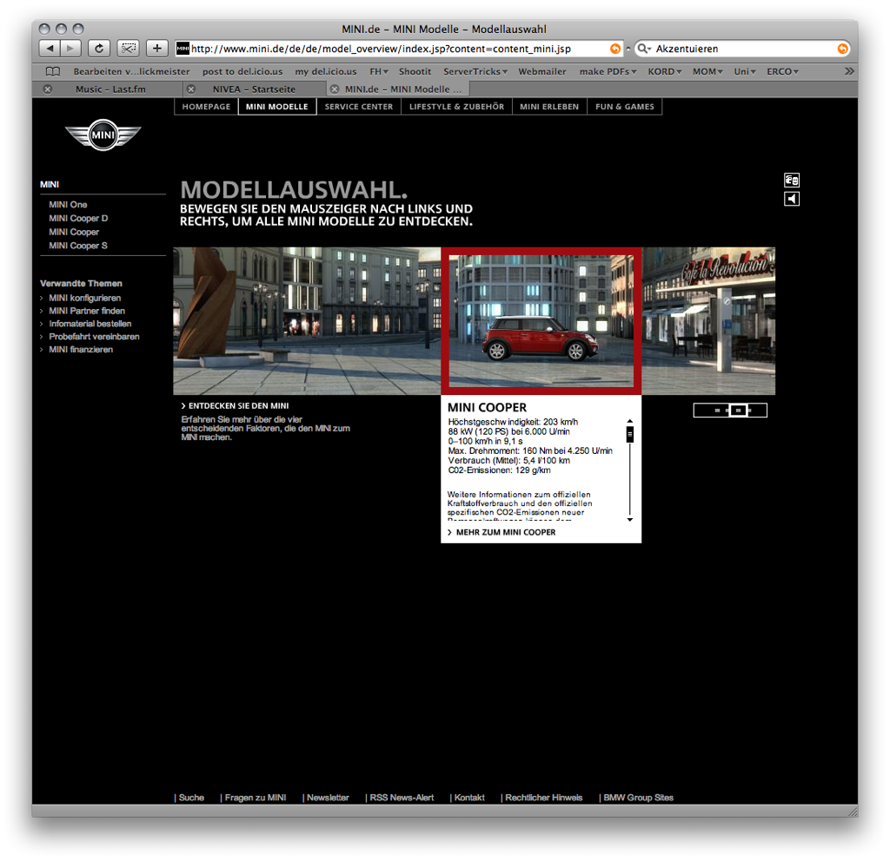











<section class="image screenshot no-shadow">
  <figure>
    
    <figcaption class="bu">
      
Farbe zum Akzentuieren

      

        <a href="https://www.mini.de/" target="_blank">Mini</a>
      
 
    </figcaption>
  </figure>
</section>

