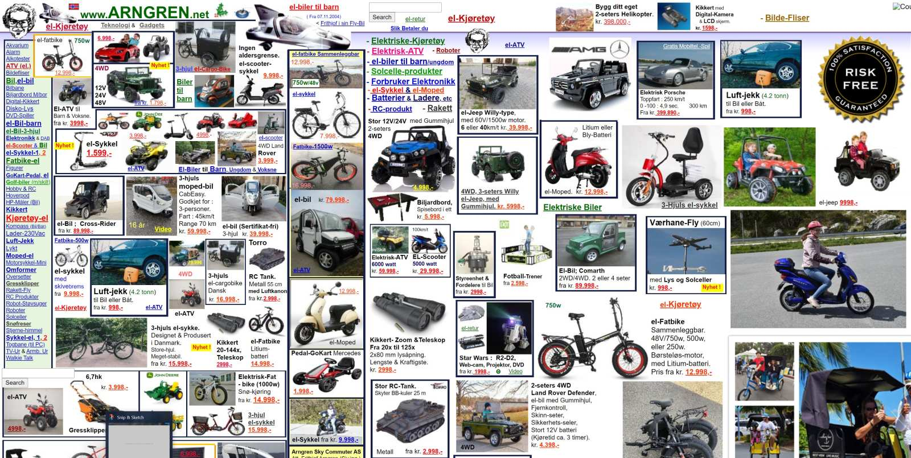
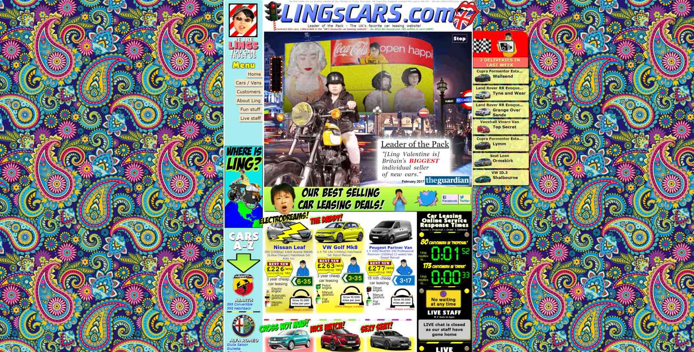

<section class="image screenshot">
  <figure>
    
    <figcaption class="bu">
      
Viel zu tun

      

        <a href="https://www.arngren.net/" target="_blank">Arngren Electronics</a>
      
 
    </figcaption>
  </figure>
</section>

<section class="image screenshot">
  <figure>
    
    <figcaption class="bu">
      
Viel zu tun

      

        <a href="https://www.lingscars.com/" target="_blank">Ling's Cars</a>
      
 
    </figcaption>
  </figure>
</section>

<section class="image screenshot">
  <figure>
    
    <figcaption class="bu">
      
Viel zu tun

      

        <a href="https://www.art.yale.edu/" target="_blank">Yale School of Art</a>
      
 
    </figcaption>
  </figure>
</section>
