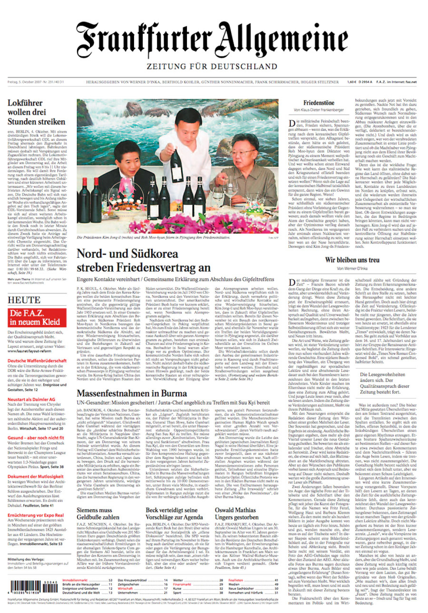
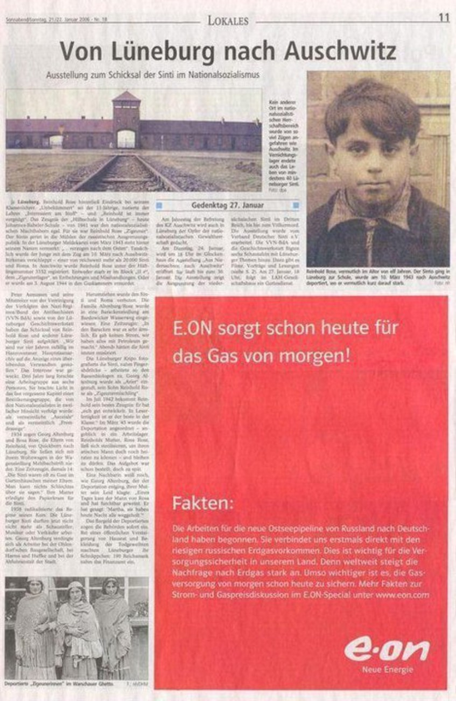

<section class="image screenshot">
  <figure>
    
    <figcaption class="bu">
      
Wie ist die Hierarchie der Elemente?

      

      Frankfurter Allgemeine (2007)
    

    </figcaption>
  </figure>
</section>

<section class="image screenshot">
  <figure >
    
    <figcaption class="bu">
      
Wie ist die Hierarchie der Elemente?

      

        Lokales (2006) // 
        <a href="https://www.dumpert.nl/item/1200691_74b43e9c" target="_blank">dumpert.nl</a>
    

    </figcaption>
  </figure>
</section>

<section class="image screenshot">
  <figure >
    
    <figcaption class="bu">
      
Wie ist die Hierarchie der Elemente?

      

        <a href="https://www.tagesschau.de/" target="_blank">tagesschau.de</a>
    

    </figcaption>
  </figure>
</section>

<section class="image screenshot">
  <figure >
    
    <figcaption class="bu">
      
Wie ist die Hierarchie der Elemente?

      

      <a href="https://www.amazon.de/" target="_blank">amazon.de</a>
    

    </figcaption>
  </figure>
</section>

<section class="image screenshot">
  <figure >
    
    <figcaption class="bu">
      
Wie ist die Hierarchie der Elemente?

      

      <a href="https://www.zdf.de/" target="_blank">zdf.de</a>
    

    </figcaption>
  </figure>
</section>

<section class="image screenshot">
  <figure >
    
    <figcaption class="bu">
      
Wie ist die Hierarchie der Elemente?

      

      <a href="https://tunnel7.com" target="_blank">tunnel7.com</a>
    

    </figcaption>
  </figure>
</section>